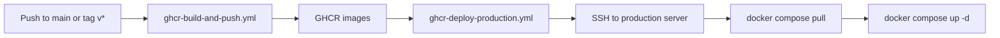

# CI/CD with GitHub Actions and GHCR

**Start here for all environments:** [DEPLOY.md](./DEPLOY.md) (local vs LAN build vs production GHCR).

## Overview



| Step | Where | What |
|------|--------|------|
| Build | GitHub Actions | Build Docker images, push to `ghcr.io/<owner>/erpq-*` |
| Configure | Production server | `.env.production` (secrets, URLs, `GHCR_OWNER`, `APP_VERSION`) |
| Deploy | GitHub Actions | SSH to server, `pull` + `up` (no build on server) |

LAN VM default: **build from PC** (`scripts/lan-deploy.ps1` + `docker-compose.lan.build-from-source.yml`).  
LAN optional: **GHCR pull** (`scripts/lan-ghcr.sh`) after push to `main`.  
Production: **GHCR only** (no build on server).

## Workflows

### 1. `ghcr-build-and-push.yml` (already in repo)

**Triggers:** push to `main`, tags `v*` (e.g. `v0.1.12`)

**Images pushed:**

- `erpq-core`, `erpq-auth`, `erpq-auth-web`, `erpq-apigate`, `erpq-comdash`, `erpq-erp-proxy`, `erpq-docq`

**Tags per push:**

| Event | Example tags |
|-------|----------------|
| Push to `main` | `latest`, `main`, `sha-abc1234` |
| Tag `v0.1.12` | `v0.1.12`, `latest` (if default branch rules apply) |

Set **Repository variables** (Settings -> Variables -> Actions) for production browser URLs baked into `auth-web` / `comdash` builds:

- `NEXT_PUBLIC_APIGATE_URL` — e.g. `https://cityqerp.ortusolis.in/api`
- `NEXT_PUBLIC_COMDASH_URL` — e.g. `https://cityqerp.ortusolis.in`
- `NEXT_PUBLIC_AUTHQ_URL` — e.g. `https://cityqerp.ortusolis.in/auth`

### 2. `ghcr-deploy-production.yml` (new)

**Triggers:**

- Automatically after a successful build on `main` (deploys tag **`latest`**)
- Manually: Actions -> Deploy production -> Run workflow (choose `app_version`)

**Requires GitHub Environment `production`** (optional but recommended) and secrets below.

## One-time server setup

1. Install Docker + Compose plugin on the production host.

2. Clone or sync this repo to a fixed path, e.g. `/opt/erpq`:

   ```bash
   sudo mkdir -p /opt/erpq
   sudo chown "$USER:$USER" /opt/erpq
   git clone <your-repo-url> /opt/erpq
   ```

3. Create secrets file (never commit):

   ```bash
   cp .env.production.example .env.production
   nano .env.production
   ```

   Minimum:

   ```env
   GHCR_OWNER=your-github-user-or-org
   GHCR_PREFIX=erpq
   APP_VERSION=latest
   JWT_SECRET=...
   CITYQ_INTERNAL_KEY=...
   # ... all production URLs and ERP/Zoho secrets
   ```

4. Create a **deploy** SSH user with key-only login; add your CI public key to `~/.ssh/authorized_keys`.

5. If GHCR packages are **private**, the server must `docker login ghcr.io` — the deploy workflow does this using `GHCR_PULL_TOKEN`.

## GitHub repository configuration

### Secrets (Settings -> Secrets and variables -> Actions)

| Secret | Purpose |
|--------|---------|
| `PROD_SSH_HOST` | Server hostname or IP |
| `PROD_SSH_USER` | SSH user (e.g. `deploy`) |
| `PROD_SSH_PRIVATE_KEY` | Private key PEM for that user |
| `GHCR_PULL_TOKEN` | PAT with `read:packages` (classic) or fine-grained packages read |

`GITHUB_TOKEN` in the build workflow already pushes packages; the server needs its own PAT to pull private images.

### Variables (optional)

| Variable | Default | Purpose |
|----------|---------|---------|
| `PROD_DEPLOY_PATH` | `/opt/erpq` | Directory with compose files + `.env.production` |
| `PROD_USE_TRAEFIK` | `1` | Also use `docker-compose.traefik.yml` when present |

### Environment

Create environment **`production`** and optionally require manual approval before deploy.

## Tag strategy (important)

`docker-compose.production.yml` resolves images as:

`ghcr.io/${GHCR_OWNER}/${GHCR_PREFIX}-<service>:${APP_VERSION}`

The deploy workflow sets **`APP_VERSION` for that run** (overrides `.env.production` when exported before compose).

| Deploy method | Set `APP_VERSION` to |
|---------------|----------------------|
| Auto deploy after `main` build | `latest` |
| Release tag `v0.1.12` | Run manual deploy with `v0.1.12` |
| Pin to one commit | `sha-<short>` from GHCR package tags |

Keep `.env.production` `APP_VERSION=latest` if you always auto-deploy from `main`.

## Manual deploy without Actions

On the server:

```bash
cd /opt/erpq
echo "$GHCR_PAT" | docker login ghcr.io -u YOUR_OWNER --password-stdin
APP_VERSION=latest ./deploy.sh
```

With Traefik:

```bash
COMPOSE_FILE=docker-compose.production.yml docker compose \
  -f docker-compose.production.yml -f docker-compose.traefik.yml \
  --env-file .env.production pull
# or extend deploy.sh similarly
```

## LAN vs production

| | LAN VM | Production |
|--|--------|------------|
| Build | PC -> VM context, or GHCR pull | **GitHub Actions only** |
| Deploy | `lan-deploy.ps1` | `ghcr-deploy-production.yml` |
| Compose | `docker-compose.lan.build-from-source.yml` | `docker-compose.production.yml` (+ Traefik) |

## Troubleshooting

- **pull 401/403:** `GHCR_PULL_TOKEN` expired or package private without login.
- **Wrong UI URLs:** rebuild `auth-web` / `comdash` after setting `NEXT_PUBLIC_*` variables.
- **Old containers:** check `APP_VERSION` matches the tag you pushed; run manual deploy with the correct tag.
- **SSH fails:** verify `PROD_SSH_*` and server `authorized_keys`; test `ssh deploy@host`.
