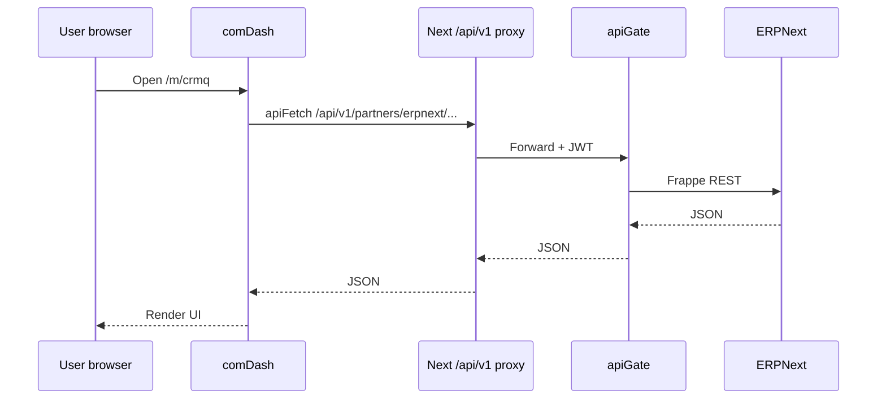

# erpQ — PowerPoint slides: Frontend & API developer walkthrough

**Use with:** [KNOWLEDGE_TRANSFER.md](./KNOWLEDGE_TRANSFER.md)  
**Duration:** ~45 minutes (30 slides + 10 min live demo + Q&A)  
**Audience:** Frontend developers, full-stack developers calling apiGate

---

## How to build the PowerPoint file

1. Open PowerPoint → **Home → New Slide → Slides from Outline**.
2. Paste **only the “Slide title” and bullet lines** from each slide below (skip “Speaker notes” and “Demo” blocks), **or** copy slide-by-slide into blank layouts.
3. Recommended theme: simple corporate; use **Title + Content** for most slides, **Title Only** for architecture diagrams.
4. For mermaid diagrams: export from [mermaid.live](https://mermaid.live) or redraw as SmartArt; source diagrams are in `KNOWLEDGE_TRANSFER.md` §2.
5. **Live demo slides** (marked 🎬): switch to browser; do not overcrowd with text.

**File naming suggestion:** `erpQ_KT_Frontend_API_Walkthrough.pptx`

---

## Slide 1 — Title

**Slide title:** erpQ platform — Frontend & API developer walkthrough

**Bullets:**
- CityQ portal (comDash) + API gateway (apiGate)
- How auth, routing, and ERP calls work end-to-end
- What you build next: pages, gateway clients, partner APIs

**Speaker notes:** This session is for people who ship UI and call backend APIs. DB and pure DevOps topics are in the main KT doc; we focus on the browser → apiGate path.

---

## Slide 2 — What you are building on

**Slide title:** Monorepo map (your daily touchpoints)

**Bullets:**
- **comDash** — portal shell, sidebar, `ModuleOutlet`, Next.js App Router
- **apiGate** — JWT, ERP REST proxy, portal menu, MQ events, partner routes
- **auth-web / authQ** — login; issues JWT used everywhere
- **crmQ / docQ UI** — domain screens imported into comDash (not separate public apps today)
- **frappeRestQ** — server-side only (apiGate/services); browsers never use it directly

**Speaker notes:** If you only remember three names: comDash, apiGate, auth.

---

## Slide 3 — Golden rules

**Slide title:** Rules every FE/API developer must follow

**Bullets:**
- Browser calls **same origin** `/api/v1/...` (comDash proxies to apiGate)
- **Never** put ERPNext API keys in frontend code or `NEXT_PUBLIC_*`
- Every API call sends **CityQ JWT** (`Authorization: Bearer` or cookie via proxy)
- New UI = route + menu + (optional) `ModuleOutlet` mapping
- App source: **JavaScript / JSX only** (repo policy)

**Speaker notes:** Breaking the proxy model causes CORS pain and leaks secrets.

---

## Slide 4 — Architecture (one picture)

**Slide title:** Request path: browser → portal → gateway → backends

**Bullets:**
- User → **comDash** (pages under `/m/...`)
- `apiFetch("/api/v1/...")` → Next proxy → **apiGate**
- apiGate → ERPNext / docQ / coreQ / RabbitMQ
- ERP remains system of record; portal does not own ERP data model

**Speaker notes:** Show mermaid diagram from `KNOWLEDGE_TRANSFER.md` §2 on this slide as a full-bleed image.

---

## Slide 5 — URLs in dev vs LAN vs prod

**Slide title:** Which URL goes where

**Bullets:**
- **User opens:** `NEXT_PUBLIC_COMDASH_URL` (portal)
- **Login:** `NEXT_PUBLIC_AUTH_URL` → auth-web `/login`
- **Browser API base:** usually **empty** `NEXT_PUBLIC_APIGATE_URL` → same origin `/api/v1`
- **Server-side proxy target:** `APIGATE_INTERNAL_URL` (e.g. `http://apigate:8080` in Docker)
- **LAN testers:** never use `localhost` in public env vars if the server is another machine

**Speaker notes:** Common bug: laptop opens `localhost:13000` but API points at wrong host.

---

## Slide 6 — Authentication flow

**Slide title:** Login → JWT → API calls

**Bullets:**
1. User completes OAuth on **auth-web** (Zoho / Google per env)
2. Redirect back with token in URL hash `cityq_token=...` or stored in `localStorage`
3. `getAccessToken()` in `comDash/src/lib/apigate.js` reads token
4. `apiFetch` attaches `Authorization: Bearer <jwt>`
5. apiGate `jwtVerify` on protected routes; 401 → redirect login (with doc/workdrive exceptions)

**Speaker notes:** apiGate also reads cookie `cityq_access_token` for server-side tools.

---

## Slide 7 — The API proxy (why it exists)

**Slide title:** comDash runtime proxy: `/api/v1/*` → apiGate

**Bullets:**
- File: `comDash/src/app/api/v1/[...path]/route.js`
- Reads **`APIGATE_INTERNAL_URL`** at request time (not bake-time)
- Forwards Authorization, Content-Type, Cookie
- **Why:** no CORS, no LAN IP in client bundle, works in Docker and local dev

**Speaker notes:** Contrast with `next.config.js` rewrites which freeze env at build time.

---

## Slide 8 — `apiFetch` (your main tool)

**Slide title:** Client helper: `comDash/src/lib/apigate.js`

**Bullets:**
- `apiBase` — `NEXT_PUBLIC_APIGATE_URL` or `""` (same origin)
- `getAccessToken()` — localStorage + hash intercept
- `apiFetch(path, init)` — adds JWT, JSON content-type, `credentials: include`
- Expired JWT → `redirectToLogin()`
- 401 on workdrive/doc partners → show error in UI (no forced logout)

**Speaker notes:** Always prefer `apiFetch` over raw `fetch` to ERP URLs.

---

## Slide 9 — Example: call portal menu API

**Slide title:** Code pattern — GET portal menu

**Bullets:**
```javascript
import { apiFetch } from "@/lib/apigate";

const res = await apiFetch("/api/v1/portal/menu");
const menu = await res.json();
```
- Path is relative to portal origin
- Proxy forwards to `http://apigate:8080/api/v1/portal/menu`
- Requires valid JWT

**Speaker notes:** Live: Network tab should show request to your portal host, not `:18080` from another machine’s browser (unless external api URL is set).

---

## Slide 10 — ERP from the browser (via gateway)

**Slide title:** ERPNext REST — only through apiGate

**Bullets:**
- Prefix: `/api/v1/partners/erpnext` (legacy mirror: `/api/v1/erp`)
- List: `GET .../resource/Lead?fields=...&filters=...`
- One doc: `GET .../resource/Lead/{name}`
- Create/update/delete: POST / PUT / DELETE on resource paths
- Method: `POST .../method` body `{ "method": "path", "args": {} }`
- Allowlist: gateway env `ERP_DEFAULT_DOCTYPES` / `ERP_ACCESS_MAP_JSON`

**Speaker notes:** Frappe permissions still apply; integration user must have rights.

---

## Slide 11 — `ErpNextGatewayClient` (crmQ pattern)

**Slide title:** Reusable ERP client in domain packages

**Bullets:**
- File: `crmQ/src/api/gatewayErpNextClient.js`
- Constructor: `baseUrl`, `getAccessToken`, optional `apiPrefix`
- Methods: `list`, `get`, `create`, `update`, `delete`, `callMethod`
- Throws `GatewayErpNextError` with status + body
- Use from React with `baseUrl: ""` or portal origin + `getAccessToken` from shell

**Speaker notes:** Copy this pattern for new modules instead of inventing fetch wrappers.

---

## Slide 12 — Example: list Leads

**Slide title:** Code pattern — list ERP documents

**Bullets:**
```javascript
const client = new ErpNextGatewayClient({
  baseUrl: "",
  getAccessToken: () => localStorage.getItem("cityq_access_token"),
});
const rows = await client.list("Lead", {
  fields: ["name", "lead_name", "status"],
  filters: [["status", "=", "Open"]],
  limit_page_length: 20,
});
```
- `filters` / `fields` are JSON-encoded query params per Frappe rules

**Speaker notes:** Demo in CRM lead list screen if available.

---

## Slide 13 — docQ / WorkDrive partner routes

**Slide title:** Non-ERP APIs: document partner proxy

**Bullets:**
- Browser calls: `/api/v1/partners/workdrive/...` (proxied to **docQ** service)
- Enabled when `DOCQ_URL` set on apiGate
- JWT required; docQ enforces workflow + Zoho permissions
- 401 handling: UI may show error without logging user out (`apiFetch` exception)
- UI entry: `/m/docq`, components under `comDash/.../doc-q/`

**Speaker notes:** docQ has its own Postgres schema; UI still never talks to Postgres directly.

---

## Slide 14 — Portal navigation (two sources)

**Slide title:** Sidebar and routes

**Bullets:**
- **Static menu:** `comDash/src/ui/routes/sitemap.js`
- **Dynamic menu:** `GET /api/v1/portal/menu` (apiGate `portal.js`)
- **Route → screen:** `comDash/src/components/portal/ModuleOutlet.jsx`
- App Router pages: `comDash/src/app/(portal)/m/<module>/...`
- Example: `m/docq/[[...slug]]/page.jsx` → renders `ModuleOutlet`

**Speaker notes:** Keep sitemap and ModuleOutlet in sync when adding screens.

---

## Slide 15 — Add a new screen (checklist)

**Slide title:** Recipe: new portal page

**Bullets:**
1. Add route file under `src/app/(portal)/m/myfeature/...` **or** branch in `ModuleOutlet`
2. Add menu item in `sitemap.js` and/or portal menu API
3. Build UI with Ant Design; data via `apiFetch` or `ErpNextGatewayClient`
4. Test JWT + 401 redirect on expired token
5. Optional: fire `POST /api/v1/mq/events` with `portal.module_viewed` (shell may already do this)

**Speaker notes:** No new public Docker service required for UI-only features.

---

## Slide 16 — Module packages (crmQ, hrQ, purQ)

**Slide title:** Bundled domain UI in comDash

**Bullets:**
- Packages live in sibling folders (`crmQ/`, `hrQ/`, `purQ/`)
- Webpack alias in `comDash/next.config.js` (e.g. `@cityq/crmq`)
- Docker build **copies** sibling packages into comDash image
- Dynamic import for some shells: `dynamic(() => import("@cityq/hrq"))`
- crmQ routes often wired explicitly in `ModuleOutlet` (pathname matching)

**Speaker notes:** “Module” ≠ separate deployed website in baseline architecture.

---

## Slide 17 — ERP desk iframe (embedding)

**Slide title:** Embedding ERPNext desk in the portal

**Bullets:**
- **erp-proxy** service strips frame-blocking headers for iframe embed
- Portal passes `deskBaseUrl` / query into iframe components (crmQ patterns)
- Env: `ERPNEXT_PUBLIC_URL`, `ERPNEXT_IFRAME_QUERY`
- Redirect: `/m/erp` → crm iframe route (see `next.config.js` redirects)
- Still not a substitute for REST — use gateway for data grids/forms you own

**Speaker notes:** iframe = ERP UX inside shell; gateway = your custom UX.

---

## Slide 18 — MQ from the UI (optional telemetry/workflows)

**Slide title:** Publishing events from the browser

**Bullets:**
- Endpoint: `POST /api/v1/mq/events`
- Body: `{ "type": "crm.lead.created", "payload": { ... } }`
- Exchange: `cityq.events` (topic); routing key = event type
- MQ disabled → 503; publish failure may return 202 (UI should not break)
- `ModuleOutlet` sends `portal.module_viewed` on navigation (best-effort)

**Speaker notes:** Heavy workflows should be consumed server-side (`mqWorkflowConsumer.js`).

---

## Slide 19 — apiGate routes cheat sheet

**Slide title:** apiGate — routes you will call or extend

| Method | Path | Auth |
|--------|------|------|
| GET | `/health` | No |
| GET | `/api/v1/portal/menu` | JWT |
| GET/POST/... | `/api/v1/partners/erpnext/resource/...` | JWT |
| POST | `/api/v1/partners/erpnext/method` | JWT |
| * | `/api/v1/partners/workdrive/*` | JWT → docQ |
| POST | `/api/v1/mq/events` | JWT |
| * | `/api/v1/core/*` | Proxied to coreQ |

**Speaker notes:** Full table in `apiGate/README.md`.

---

## Slide 20 — Extending apiGate (backend-facing FE teams)

**Slide title:** When you need a new API surface

**Bullets:**
- Prefer **existing** ERP partner routes before new bespoke endpoints
- New third-party: add `apiGate/src/partners/<name>/plugin.js`, register in `server.js`
- Proxy pattern: `@fastify/http-proxy` to internal service (see workdrive plugin)
- Env in `apiGate/src/config.js` + `.env.example`
- Browser still calls `/api/v1/partners/<name>/...` through comDash proxy

**Speaker notes:** Pair with backend dev for JWT hooks and rate limits.

---

## Slide 21 — Environment variables (frontend-relevant)

**Slide title:** Env vars checklist

**Bullets:**
| Variable | Who reads it |
|----------|----------------|
| `NEXT_PUBLIC_COMDASH_URL` | Browser (links) |
| `NEXT_PUBLIC_AUTH_URL` | Browser (login redirect) |
| `NEXT_PUBLIC_APIGATE_URL` | Browser (optional external API host) |
| `APIGATE_INTERNAL_URL` | comDash server proxy only |
| `JWT_SECRET` | authQ, apiGate, docQ (must match) |
| `ERPNEXT_*` | apiGate server only — never `NEXT_PUBLIC_` |

**Speaker notes:** Copy from `.env.example` / `.env.lan.example`.

---

## Slide 22 — Debugging toolkit

**Slide title:** When something fails

**Bullets:**
- `GET <apigate>/health` — erp, docq, coreq, authq status
- Browser DevTools → Network → filter `api/v1`
- 401 everywhere → JWT_SECRET mismatch or expired token
- ERP 403/404 → allowlist or Frappe permissions
- docQ 503 → `docq_unreachable` — container/network
- CORS errors → you probably bypassed comDash proxy

**Speaker notes:** Keep a known-good JWT from dev login for curl tests.

---

## Slide 23 — curl lab (API developers)

**Slide title:** Manual API test (after login)

**Bullets:**
```bash
# Health (no auth)
curl -s http://localhost:18080/health

# ERP list (replace TOKEN)
curl -s -H "Authorization: Bearer TOKEN" \
  "http://localhost:18080/api/v1/partners/erpnext/resource/Lead?limit_page_length=5"

# MQ event
curl -s -X POST -H "Authorization: Bearer TOKEN" \
  -H "Content-Type: application/json" \
  -d "{\"type\":\"portal.module_viewed\",\"payload\":{\"moduleKey\":\"test\"}}" \
  http://localhost:18080/api/v1/mq/events
```

**Speaker notes:** On LAN, replace host/port from `.env` publish variables.

---

## Slide 24 — 🎬 Live demo script (10 minutes)

**Slide title:** Live walkthrough — follow along

**Bullets:**
1. Open portal URL → log in
2. Open DevTools → Network → preserve log
3. Navigate to CRM or Documents → confirm calls to `/api/v1/...` on **portal host**
4. Inspect one request: Request headers include `Authorization: Bearer`
5. Open `apiGate /health` in new tab — note `erp`, `docq` status
6. (Optional) Trigger MQ event or navigation → see `mq/events` POST
7. Show repo: `apigate.js`, proxy `route.js`, `ModuleOutlet.jsx`

**Speaker notes:** Pause after step 4; let team verify same-origin pattern.

---

## Slide 25 — Common mistakes

**Slide title:** Pitfalls we have seen

**Bullets:**
- Calling `ERPNEXT_URL` directly from React
- Hardcoding `http://localhost:18080` in client code on LAN
- Adding route file but not `ModuleOutlet` / menu entry
- Mismatched `JWT_SECRET` between authQ and apiGate → random logout
- Assuming hrQ/purQ menu visible = routes exist (check `CITYQ_PORTAL_*` flags)
- Using TypeScript in new app files (repo policy: JS/JSX only)

---

## Slide 26 — Your first tasks (week 1)

**Slide title:** Suggested onboarding tasks

**Bullets:**
1. Run stack locally; log in; hit three modules (crm, doc, iframe if enabled)
2. Add a **dummy page** under `/m/crmq/hello` in `ModuleOutlet` + sitemap
3. Call `GET /api/v1/portal/menu` from a small debug button using `apiFetch`
4. List one DocType via `ErpNextGatewayClient` in console or test page
5. Read `apiGate/README.md` ERP table + `KNOWLEDGE_TRANSFER.md` §5.3–5.5

**Speaker notes:** Assign a mentor for PR on first menu + route change.

---

## Slide 27 — References & Q&A

**Slide title:** Documentation and next steps

**Bullets:**
- Main KT: `docs/KNOWLEDGE_TRANSFER.md`
- Deploy: `docs/DEPLOY.md`, `docs/DEPLOYMENT_GUIDE.md`
- apiGate API: `apiGate/README.md`
- Architecture baseline: `docs/PLATFORM_ARCHITECTURE_PLAN.md`
- Questions → team channel / engineering lead

**Speaker notes:** Share link to repo docs folder; record session if possible.

---

## Appendix A — One-slide architecture (paste as image caption)

Copy this mermaid into mermaid.live for PNG/SVG:



---

## Appendix B — PowerPoint slide layout map

| Slide # | Layout suggestion |
|---------|-------------------|
| 1 | Title slide |
| 4, 24 | Full-width picture / demo |
| 9, 12, 23 | Title + Content (code in monospace text box) |
| 19 | Title + Table |
| Rest | Title and Content (max 5 bullets) |

---

## Appendix C — Import via Pandoc (optional)

If you have [Pandoc](https://pandoc.org/) installed:

```bash
cd "docs"
pandoc KNOWLEDGE_TRANSFER_SLIDES_FE_API.md -o erpQ_KT_FE_API.pptx
```

You may need to strip speaker notes or use a custom reference template for cleaner slides.

---

*Slide deck version: 1.0 · Pair with `KNOWLEDGE_TRANSFER.md` for DB/DevOps/deployment sections.*
