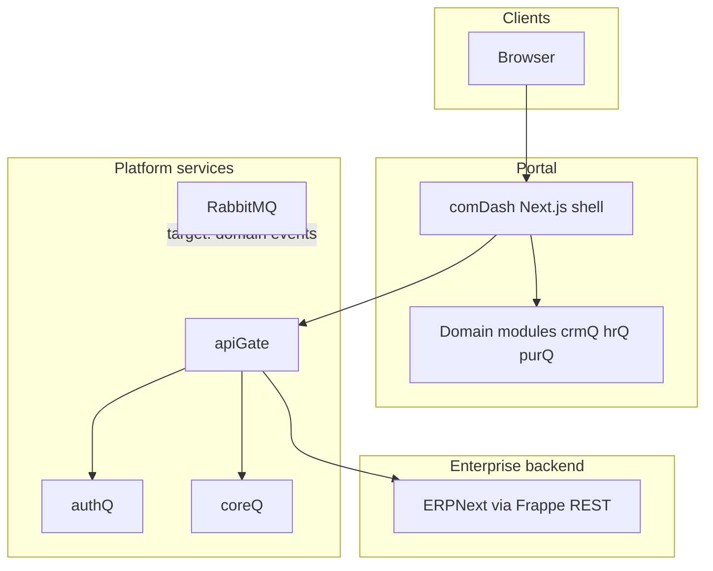

# Platform architecture & delivery plan

**Document type:** Architecture baseline and phased delivery plan  
**Product:** erpQ (CityQ / portal + ERP integration)  
**Status:** Baseline as-built + agreed target state  
**Version:** 1.0 · **Date:** 2026-04-15

---

## 1. Purpose and scope

This document defines **how the system is structured**, **what is shared vs optional**, **how clients reach ERP data**, and **what remains to be built** to meet multi-tenant, modular, and lite-deployment goals. It is written for **stakeholder sign-off** and **engineering execution**.

**In scope:** Web portal (comDash), API gateway (apiGate), identity (authQ), core configuration (coreQ), messaging infrastructure (RabbitMQ), domain UI modules (crmQ, hrQ, purQ), and ERPNext integration via apiGate.

**Out of scope (unless later revision):** ERPNext internals, customer-specific custom code branches, non-erpQ infrastructure (DNS, CDN, K8s) except as assumptions.

---

## 2. Design principles

1. **Single entry for users:** All browser UI is served through the portal shell (**comDash**).
2. **Single public API edge:** Browser and integrations use **apiGate** (JWT); no direct browser-to-ERP for application APIs.
3. **Modular domain UI:** CRM, HR, Purchasing ship as **packages** (`@cityq/crmq`, `@cityq/hrq`, `@cityq/purq`) mounted by the shell—not as separate public “mini-sites” in the current baseline.
4. **Platform vs domain:** authQ, apiGate, coreQ, RabbitMQ, and comDash **shell** are **platform**; crmQ/hrQ/purQ are **domain UI** (workflow and presentation over agreed backends).
5. **Configuration:** Module visibility and integration flags trend toward **coreQ** as source of merged truth; secrets remain in environment/Vault.
6. **Future decoupling:** Shell-to-module coupling should move to a **published SDK contract** (auth, theme, navigation, events); optional **SKU builds** or **remote modules** for lite images and independent release where justified.

---

## 3. Logical architecture

| Layer | Responsibility |
|-------|----------------|
| **comDash** | Layout, navigation, auth session bridge, module outlet, shared UI context |
| **Domain modules** | Dashboards, list views, desk iframes; call apiGate only (no direct ERP from browser) |
| **apiGate** | JWT validation, ERP proxy, portal menu assembly, partner routes |
| **authQ** | Login UI + token issuance contract with apiGate |
| **coreQ** | Settings, feature flags, merged JSON config (authority per roadmap) |
| **RabbitMQ** | Async messaging infrastructure; **domain use** to be formalized in a later phase |
| **ERPNext** | System of record for DocTypes exposed through apiGate |

---

## 4. Deployment (physical) view

| Artifact | Role | Notes |
|----------|------|--------|
| `erpq/comdash` image | Portal + **bundled** domain UI packages at build time | crmQ, hrQ, purQ copied in Dockerfile; webpack aliases resolve packages |
| `erpq/apigate` image | API gateway | Serves `/api/v1/portal/menu`, ERP proxy routes |
| `erpq/auth`, `erpq/auth-web` | Auth API + login UI | |
| `erpq/core` | Core/settings API | |
| RabbitMQ container | Message broker | Present; **application-level** publishers/consumers not fully implemented for cross-module workflows |

**Important:** Domain UI packages are **not** separate Docker services in the baseline; they are **libraries compiled into comDash**. Optional future shapes (per-SKU slim images, path-routed mini-apps, Module Federation remotes) are **delivery options**, not the current deployment fact.

---

## 5. Integration patterns

### 5.1 Authentication

- User authenticates via **auth-web** / auth flow; **JWT** presented to **apiGate** on API calls.
- comDash obtains token via agreed client helpers; modules receive **getAccessToken** / **apiBase** through shell props.

### 5.2 ERP data access

- Modules use **ErpNextGatewayClient** (shared pattern) → apiGate `/api/v1/partners/erpnext/...` → ERPNext REST.
- Desk embedding uses iframe URLs configured through portal context (desk base URL, query).

### 5.3 Portal navigation

- Left menu structure from **GET** `/api/v1/portal/menu` (apiGate).
- Feature toggles (e.g. HR/Purchasing visibility) via environment variables on apiGate without rebuilding images for menu-only changes.

### 5.4 Async integration (target)

- **RabbitMQ** reserved for **commands/events** between services/modules once per-module backends and contracts exist.
- **No** cross-module database reads as an integration pattern in the target model.

---

## 6. Data architecture decision (required)

Two coherent models; **the product must explicitly choose** (can mix only with clear boundaries):

| Option | Description | Implication |
|--------|-------------|--------------|
| **A — ERP as one bounded context** | One ERP site/DB; CRM/HR/Purchasing are **functional slices** over shared DocTypes | Matches current **single REST surface**; internal ERP relations exist |
| **B — Strict module isolation** | Separate **service + database per domain**; integration via **API + messages** only | Requires new/extended backends; ERP may be split or wrapped per module |

**Current implementation:** **Option A** for UI data paths. Requirements for “no cross-module DB” and “multi-DB” apply fully only under **Option B** or a hybrid with explicit service boundaries.

---

## 7. Baseline vs target (summary)

| Topic | Baseline (today) | Target (agreed direction) |
|-------|------------------|---------------------------|
| UI packaging | All selected modules **bundled** in comDash image | **SKU builds** (subset of modules per image) and/or **remote modules** where needed |
| Shell ↔ module coupling | Webpack aliases + dynamic `import()` | **Platform SDK** + optional Federation / mini-apps |
| Menu vs image | Env can hide menu; image may still contain code | Align **menu**, **compose**, and **build matrix** per customer SKU |
| MQ | Infra up; not domain-event backbone yet | Exchanges, routing, consumers for workflows |
| coreQ vs apiGate | Partial merge of flags/settings | **coreQ** as merged config authority consumed by apiGate |

---

## 8. Delivery roadmap (phased)

| Phase | Deliverable | Outcome |
|-------|-------------|---------|
| **P0 — Baseline** | Portal + apiGate + auth + core + bundled crm/hr/pur | **Done:** single stack, ERP via gateway, portal menus |
| **P1 — Contract** | Define **platform SDK** (interfaces for auth, nav, theme, events) | Modules do not import shell internals; easier SKU/Federation later |
| **P2 — SKU images** | CI/build-args: comDash images with **only** subscribed modules | Smaller deployable; true lite customer stacks |
| **P3 — UX hardening** | “Module unavailable” for missing routes/remotes/upstreams | Clear failure modes |
| **P4 — Backend fork (if Option B)** | Per-module services, DBs, MQ publishers/consumers | Meets strict isolation and event-driven integration |
| **P5 — Optional UI remotes** | Pilot: Federation **or** path-routed mini-app for one module | Independent UI release cadence for high-churn modules |

Phases P4–P5 depend on **§6 decision** and business priority.

---

## 9. Key repository references

| Area | Path |
|------|------|
| Module outlet | `comDash/src/components/portal/ModuleOutlet.jsx` |
| Webpack aliases | `comDash/next.config.js` |
| Portal menu API | `apiGate/src/routes/portal.js` |
| comDash container build | `comDash/Dockerfile` |
| Stack | `docker-compose.yml` |
| ERP client pattern | `crmQ/src/api/gatewayErpNextClient.js` |

---

## 10. Assumptions and constraints

- JavaScript/JSX for application source per repository policy.
- One gateway (apiGate); no duplicate edge API for the same role.
- ERP availability is **optional** at platform level; gateway behavior must tolerate ERP off where designed.

---

## 11. Approval

| Role | Name | Date | Signature |
|------|------|------|-----------|
| Product owner | | | |
| Engineering lead | | | |
| Architecture / security | | | |

---

*End of document.*
